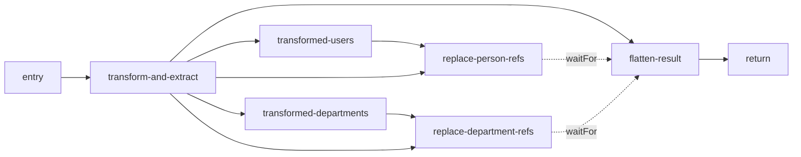

# Flow Unit DSL And Editor Design

## 上下文

这个 track 把 Flow 从 Workbench 私有文件提升为 Halfcode bundle unit。规范、contract、loader/compiler 和 canonical fixture 的 owner 是 `dg-cell-mvi`；Workbench 只是 authoring client。首轮设计必须能同时表达最小 Welcome 与原复杂 CtrlFlow/DataFlow main/subflow，但不得用“先做执行器”掩盖 DSL 问题。

## 1. Bundle 与 Unit 模型

Canonical bundle 根改为 `<AppBundle>`。`Unit.kind` 使用小写 kebab-case；目标文件根 tag 使用领域名 PascalCase。`kind` 与 tag 必须一一对应。

```xnl
<AppBundle #dg.demo.flow.App version="0.1.0" (
  <Units [
    <Unit kind="ctrl-flow" fqn="dg.demo.flow.WelcomeCtrl"
          src="vfs://./flows/welcome.CtrlFlow.xnl">
    <Unit kind="data-flow" fqn="dg.demo.flow.WelcomeData"
          src="vfs://./flows/welcome.DataFlow.xnl">
    <Unit kind="ctrl-flow" fqn="dg.demo.flow.ComplexCtrl"
          src="vfs://./flows/complex-ctrl/manifest.xnl">
    <Unit kind="data-flow" fqn="dg.demo.flow.TransformMain"
          src="vfs://./flows/transform-main/manifest.xnl">
    <Unit kind="data-flow" fqn="dg.demo.flow.TransformSub"
          src="vfs://./flows/transform-sub/manifest.xnl">
  ]>
)>
```

| Unit kind | 根 tag | Registry ref | 消费计划 |
|---|---|---|---|
| `page` | `<Page>` | `page://` | `UnitRenderPlan` |
| `component` | `<Component>` | `component://` | `UnitRenderPlan` |
| `ctrl-flow` | `<CtrlFlow>` | `ctrl-flow://` | `CtrlFlowAuthoringPlan` |
| `data-flow` | `<DataFlow>` | `data-flow://` | `DataFlowAuthoringPlan` |

Flow unit 不是 Capsule，也不进入 Vue render tree。通用 unit registry 负责 identity/visibility；按 kind 分发到各自 compiler。

### 1.1 URI scheme 使用单数 kebab-case

URI scheme 命名目标对象，不命名装载它的集合。XNL 仍可用 `<Commands>`、`<Events>`、`<Scopes>`、`<Units>` 等复数 tag 表达集合，文件和 domain key 也可继续按既有集合名组织；但引用其中一个 `Command`、`Event`、`Scope` 或 `Unit` 时，scheme 必须取被引用实体的单数名。

scheme 的多个语义词使用 `-` 连接，禁止使用 `.`。Canonical grammar 为：

```text
^[a-z][a-z0-9]*(?:-[a-z0-9]+)*$
```

`.` 仍可用于 domain/file facet、FQN 和节点 id，例如 domain `config.def`、文件 `config.def.xnl`、id `#users.query`；但它们投影为 URI 时分别是 `config-def://` 和 `...://#users.query`，`.` 不出现在 scheme 部分。

这会修订 foundation M-N2 的机械三投影规则：**domain/file/root tag 的集合词形与 entry-addressing scheme 分开投影，scheme 永远使用单数实体 stem，并将多个 stem 转为 kebab-case**。`HALFCODE_SCHEME_TABLE` 继续作为 domain -> scheme 显式映射真源，不再假设二者字符串相等。

本 track 采用以下 breaking 映射，不保留复数或 dotted compatibility alias：

| 现有/先前设计 scheme | Canonical scheme | 引用对象 |
|---|---|---|
| `pages://` | `page://` | Page unit |
| `components://` | `component://` | Component unit |
| `routes://` | `route://` | Route instance/path |
| `contracts://` | `contract://` | Contract entry |
| `contracts.def://` | `contract-def://` | Contract definition |
| `scopes://` | `scope://` | Scope |
| `commands://` | `command://` | Command |
| `commands.def://` | `command-def://` | Command payload definition |
| `events://` | `event://` | Event |
| `events.def://` | `event-def://` | Event payload definition |
| `config.def://` | `config-def://` | Config definition |
| `effect.types://` | 移除，不设替代 scheme | Effect 类别归 tag，代码签名归节点 `type` 配置 |
| `data.graph://` | `data-graph://` | DataGraph module |
| `data.graph.logic.types://` | 移除，不设替代 scheme | Graph logic 类别归 node tag，代码签名归节点 `type` 配置 |
| `data.graph.seed://` | `data-graph-seed://` | DataGraph seed |
| `scope.runtime://` | `scope-runtime://` | scope-visible runtime instance |
| `scope.effects://` | `scope-effect://` | scope-visible effect binding |
| `scope.data.graph://` | `scope-data-graph://` | scope-visible DataGraph binding |
| `ctrl-flows://` | `ctrl-flow://` | CtrlFlow unit |
| `data-flows://` | `data-flow://` | DataFlow unit |
| `flow.logic.types://` | 移除，不设替代 scheme | Flow logic 类别归 node tag，代码签名归节点 `type` 配置 |
| `flow.authoring://` | `flow-authoring://` | Flow authoring data |

已经符合规则的 `config://`、`runtime://`、`product://`、`wiring://`、`flow-node://`、`flow-port://` 与 `vfs://` 保持不变。文档中仅用于说明“不存在”的复数或 dotted URI 拼法也必须删除并改成普通文字，避免它们被误认为候选协议。

### 1.2 类型归节点，不建立 Type URI catalog

`EffectType`、`GraphLogicType`、`FlowLogicType` 不作为独立 XNL catalog 节点，也不拥有逻辑 URI scheme。类型信息按职责归回实际节点：

| 信息 | 表达位置 | 示例 |
|---|---|---|
| 领域/执行类别 | node tag | `<FuncEffect>`、`<InterfaceEffect>`、`<ComputedNode>`、`<ProcessorNode>`、`<TransformNode>`、`<SinkNode>` |
| TypeScript 输入输出或函数签名 | 节点 `type` 属性，直接使用物理代码引用 | `type = "vfs://./flow-code/main.types.ts#TransformUsersLogic"` |
| Quick/Compact 实现 | 节点 `src` 或 `impl` | `src = "vfs://./flow-code/main.impl.ts#transformUsers"` |
| Split/Public 实现 binding | Scope 按稳定领域节点 identity 装配 | Flow 使用 unit FQN + node id；Effect/DataGraph 使用各自节点 id |
| 少量闭集选项 | 节点裸 enum 属性 | `action = "consume"`、`mode = "create"` |

因此，不创建 `effect-type://`、`data-graph-logic-type://`、`flow-logic-type://`。TS 类型的事实源已经在代码 export，XNL 再建一层 type catalog 只会产生间接寻址和第二 identity。三档写法调整为：

1. **Quick**：节点只写 `src`/`impl`，类型由代码 export 自持或推导。
2. **Compact**：节点同时写 `type = "vfs://...#Type"` 与 `src`/`impl`，在同一节点完成 type/implementation pairing。
3. **Split/Public**：节点写 `type = "vfs://...#Type"`，实现由 Scope 按节点 identity 绑定；不经过 Type URI catalog。

真正的 enum 仍是父节点 schema 已知的少量闭集值，没有独立 resolver target 或实现 binding。这类值必须直接写裸值，不得包装为 URI。

## 2. Flow DSL 不变量

- 所有 Flow 节点遵循 XNL 固定槽位：`<Tag #id metadata { attributes } ( unique child domains ) [ direct/repeated children ]>`。四个槽位不可互相代用。
- metadata slot 只承载 `apiVersion`、`version` 等系统级信息；`{}` 只承载当前节点的业务属性，不承载子域或系统元信息。
- `()` 只承载每类至多一个的子域概念。同一父节点需要多个同类条目时，必须先用唯一的复数子域容器，例如 `( <Branches [ <Branch> ... ]> )`。
- `[]` 承载当前节点的直接、有序或可重复子节点。CtrlFlow 的直接语句必须直接放在 `<CtrlFlow [ ... ]>`，DataFlow 的直接图节点必须直接放在 `<DataFlow [ ... ]>`；禁止使用无领域语义的根 `<Block>` 或 `<Nodes>` wrapper。
- 根 `#id` 必须等于注册 FQN；节点 `#id` 在 flow unit 内唯一且稳定，是 editor selection/mutation identity。
- CtrlFlow 的语义边来自直接子节点顺序、嵌套节点自己的 `[]` 以及唯一 `Branches` 子域；DataFlow 的语义边来自根直接节点的 typed input connection 与显式 `waitFor` dependency。
- code type 与实现只以节点自己的 `vfs://...#export` 属性出现。XNL 禁止 inline `ExprCode` / `StatementCode`，禁止 `clazz + methodName`，也禁止额外 Type URI catalog。
- authoring plan 必须是纯 serializable data；保留 source location、未知扩展字段和 diagnostics，但不得含函数、module object、DataGraph instance 或 runtime instance。
- DataFlow 的 `flow` 字段使用 `data-flow://<FQN>`，例如 main flow 调用 `data-flow://dg.demo.flow.TransformSub`，不使用裸 `subFlow` 字符串。

例如，一个带多个命名分支和默认序列的条件节点应把唯一的 `Branches` 子域放在 `()`，把每个分支自己的语句直接放在该 `Branch` 的 `[]`；默认语句则直接放在 `If` 的 `[]`。不能再用 `NamedBlocks` / `Block` 模拟 XNL 本身已经提供的层级。

```xnl
<If #choose-user (
  <Branches [
    <Branch #active { test = "vfs://./flow-code/users.ctrl.ts#isActive" } [
      <Return #active-user { src = "vfs://./flow-code/users.ctrl.ts#returnActive" }>
    ]>
  ]>
) [
  <Return #default-user { src = "vfs://./flow-code/users.ctrl.ts#returnDefault" }>
]>
```

## 3. 三档写法

三档共享同一个 plan，不是三套 loader。

### 3.1 Quick：单文件 + 节点直接 code ref

适合 Welcome 和内部小 flow。类型来自 TS export；loader 只校验 ref 形状并原样投影。

```xnl
<CtrlFlow #dg.demo.flow.WelcomeCtrl [
  <Return #message {
    src = "vfs://./flow-code/welcome.ctrl.ts#makeWelcomeMessage"
  }>
]>
```

### 3.2 Compact：folder unit + flow-local logic catalog

适合复杂但由一个 unit 自持的 flow。Folder unit 可拆分代码 type declarations/implementations 与 XNL topology；节点用本地 `type` + `src` 表达显式的 type/implementation pairing。loader 只保存 pairing，调用语义留给 runtime-contract track。

```xnl
<CtrlFlow #dg.demo.flow.ComplexCtrl [
  <Run #init-array {
    type = "vfs://./flow-code/complex.ctrl.types.ts#InitArrayLogic"
    src = "vfs://./flow-code/complex.ctrl.impls.ts#initArray"
  }>
]>
```

### 3.3 Split/Public：公开 contract + topology + 宿主可绑定实现

适合跨 app 复用、main/subflow 和强类型边界。首个 track 负责 parse/validate/project `FlowContract`、typed flow refs 和 logic declarations；Scope 如何把实现装配到 runtime，由后续 runtime-contract track 冻结。

```xnl
<DataFlow #dg.demo.flow.TransformMain (
  <FlowContract #dg.demo.flow.TransformMain {
    input  = "vfs://./flow-code/contracts.ts#TransformInput"
    output = "vfs://./flow-code/contracts.ts#TransformOutput"
    inputPorts = ["input"]
    outputPorts = ["output"]
  }>
) [
  <EntryNode #entry>
  <SubFlowNode #transform-and-extract {
    flow = "data-flow://dg.demo.flow.TransformSub"
    inputs = {
      input = "flow-port://#entry/input"
    }
  }>
  <ReturnNode #return {
    inputs = {
      output = "flow-port://#transform-and-extract/entityDetailMap"
    }
  }>
]>
```

Split/Public 形态的 topology 只保留 logic type ref，不在 flow unit 内固定实现；宿主 Scope 如何把实现装配进 RuntimeObject 由后续 runtime-contract track 冻结。Quick/Compact 中的 `src` 也只是 opaque authoring ref，compiler 不解析 export、不校验函数签名、不执行。

## 4. CtrlFlow Authoring Plan

`CtrlFlowAuthoringPlan` 至少包含：unit identity、contract/code refs、稳定 node registry、直接子节点顺序、嵌套 sequence tree、named branch order、node config、source spans、diagnostics。复杂样例必须保留 `Declare/If/For/Break/Return/Run` 对应语义以及默认分支，不要求沿用旧 tag 的所有字段拼写，也不得在 plan 中重新制造无语义的 Block 层。

旧 inline code 迁移成独立 TS exports，例如：

```ts
export type InitArrayLogic = (
  runtime: ComplexCtrlRuntime,
  input: InitArrayInput,
  config: InitArrayConfig,
) => InitArrayOutput;
```

本 track 只把 `src` / `logic` ref 放入 plan，不调用该类型或实现。

## 5. DataFlow Authoring Plan

### 5.1 根结构与公共契约

DataFlow 根的 `[]` 直接承载图节点；`()` 只放每类唯一的子域。根不声明 `entry` / `exit` 属性，因为 `<EntryNode>` / `<ReturnNode>` 的 tag 已表达角色，重复写 id 会制造第二真源。

```xnl
<DataFlow #dg.demo.flow.WelcomeData apiVersion="halfcode.dg-cell-mvi/v1" version="0.1.0" (
  <FlowContract #dg.demo.flow.WelcomeData {
    input = "vfs://./flow-code/welcome.data.types.ts#WelcomeDataInput"
    output = "vfs://./flow-code/welcome.data.types.ts#WelcomeDataOutput"
    inputPorts = ["input"]
    outputPorts = ["output"]
  }>
) [
  <EntryNode #entry>
  <TransformNode #message {
    inputs = {
      input = "flow-port://#entry/input"
    }
    outputs = ["output"]
    src = "vfs://./flow-code/welcome.data.ts#makeWelcomeMessage"
  }>
  <ReturnNode #return {
    inputs = {
      output = "flow-port://#message/output"
    }
  }>
]>
```

`FlowContract` 是 DataFlow 的唯一公共输入/输出契约：

- `input` / `output` 指向 TS 类型，不内嵌类型实现。
- `inputPorts` 是 `<EntryNode>` 对外暴露的端口集合。
- `outputPorts` 是 `<ReturnNode>.inputs` 必须完整提供的端口集合。
- 一个 DataFlow 根恰好有一个 `<EntryNode>` 和一个 `<ReturnNode>`；identity 从节点 `#id` 派生，不在根属性重复。

### 5.2 节点类别

| Tag | 角色 | 必要属性 | 端口规则 |
|---|---|---|---|
| `EntryNode` | 接收 Flow 调用输入 | 无 | outputs 由 `FlowContract.inputPorts` 派生 |
| `TransformNode` | 转换输入并产生输出 | `inputs`、`outputs`，以及可选 `type` / `src`；可选 `waitFor` | `inputs` 的键是本节点输入端口；`outputs` 在本节点内唯一；名称不承诺实现为同步或纯函数 |
| `SinkNode` | 消费输入并完成一个因果动作 | `inputs`，以及可选 `type` / `src`；可选 `waitFor` | 没有数据输出端口，但产生可被 `waitFor` 引用的完成事实 |
| `SubFlowNode` | 调用另一个公开 DataFlow | `flow`、`inputs`；可选 `waitFor` | inputs/outputs 从目标 `FlowContract` 校验与派生，不在调用点重复声明 outputs |
| `ReturnNode` | 组装 Flow 公共输出 | `inputs`；可选 `waitFor` | `inputs` 的键必须与 `FlowContract.outputPorts` 完全一致 |

DataFlow 不使用 `ComputeNode` / `ConsumeNode`。这两个旧名分别改为 `TransformNode` / `SinkNode`，避免与 DataGraph 已有的响应式 `ComputedNode` / `ConsumerNode` 形成近义碰撞。DataGraph 的节点名保持不变，因为它们直接映射 `depa-data-graph` 的 `computed` / `consumer` kind 与 `addComputed` / `addConsumer` API；DataFlow 的名称则只描述一次 Flow 执行中的端口行为。

节点属性直接放 `{}`。旧 `GraphConfig` / `Config` wrapper 不进入 canonical DSL；它们只是旧样例的迁移输入。

### 5.3 同 Flow 节点与端口引用

DataFlow 根的直接节点形成两个当前 Flow 私有的结构派生 registry：

```text
flow-node://#<node-id>              引用节点完成事实，用于 waitFor
flow-port://#<node-id>/<port-name>  引用节点输出端口，用于 inputs
```

`flow-node` 与 `flow-port` 都由根 `[]` 的节点、节点输出端口结构派生，不是独立数据域，因此不产生对应的 XNL 文件或 wrapper。拆成两个 scheme 后，resolver 无需根据 fragment 是否包含 port path 猜测引用类别；scheme 本身就是引用类型。这与 `page://` / `route://` 一样属于 M-N4 的注册表引用。

例如：

```xnl
<TransformNode #transformed-users {
  inputs = {
    input = "flow-port://#transform-and-extract/personSet"
  }
  outputs = ["output"]
  type = "vfs://./flow-code/transform.types.ts#TransformUsersLogic"
}>
```

`flow-node://` 与 `flow-port://` 都只在当前 Flow unit 内解析，不跨 Flow。跨 Flow 只能使用 `data-flow://<FQN>` 指向公开 DataFlow unit。

### 5.4 数据依赖与 waitFor 依赖

DataFlow 明确区分两类节点依赖，不再把它们混进一个 `GraphConfig`，也不把原有 `waitFor` 改名成丢失来源语义的通用依赖术语：

- **数据边**：由 `inputs.<port> = "flow-port://#source/output"` 产生，表示目标节点读取源端口的数据。
- **waitFor 边**：由 `waitFor = ["flow-node://#source"]` 产生，表示目标节点显式依赖源节点的完成事实，不搬运数据。

对任一节点 `node`，authoring topology 中的完整依赖定义为：

```text
dataDependencies(node) = sourceNodes(node.inputs)
waitForDependencies(node) = sourceNodes(node.waitFor)
dependencies(node) = dataDependencies(node) union waitForDependencies(node)

dependencyEdges = dataEdges union waitForEdges
```

因此，一个节点在拓扑上 ready，必须同时满足其输入数据来源和全部显式 `waitFor` 前置节点。前置节点何时算成功完成、错误/取消如何传播，属于后续 execution runtime contract，本 track 不定义。

`waitFor` 是作者写入的独立语义事实。即使同一源节点也通过 `inputs` 向目标节点提供数据，compiler 仍必须保留显式 `waitFor`，不得为了去重而静默删除、改写或归一化；未来 validator 可以给出冗余提示，但不能改变 canonical authoring data。数组顺序用于稳定 round-trip，不表示多个前置节点之间存在先后顺序。

```xnl
<SinkNode #convert-basic-types {
  inputs = {
    input = "flow-port://#classify/NeedBasicConvert"
  }
  waitFor = ["flow-node://#decrypt"]
  type = "vfs://./flow-code/transform.types.ts#BasicConvertLogic"
}>
```

旧 DataFlow 到 canonical DataFlow 的依赖迁移是一对一的：

| 旧字段 | Canonical XNL | Authoring plan |
|---|---|---|
| `GraphConfig.connectedInputs[targetPort] = { nodeKey, portKey }` | `inputs.targetPort = "flow-port://#nodeKey/portKey"` | `dataEdges` |
| `GraphConfig.waitNodeKeys = [nodeKey]` | `waitFor = ["flow-node://#nodeKey"]` | `waitForEdges` |
| `GraphConfig.inputPorts` | 节点 `inputs` 的键；公共入口来自 `FlowContract.inputPorts` | node input ports |
| `GraphConfig.outputPorts` | 节点 `outputs`；公共出口来自 `FlowContract.outputPorts` | node output ports |
| `entryNodeKey` / `exitNodeKey` | `<EntryNode>` / `<ReturnNode>` tag | `entryNodeId` / `returnNodeId` |

以 `TransformMain` 为例，实线是数据依赖，虚线是显式 `waitFor` 依赖；`flatten-result` 必须等两个 consume 节点完成后才在拓扑上 ready：



### 5.5 SubFlow 契约

`SubFlowNode.flow` 必须是 `data-flow://<FQN>`：

```xnl
<SubFlowNode #transform-and-extract {
  flow = "data-flow://dg.demo.flow.TransformSub"
  inputs = {
    input = "flow-port://#entry/input"
  }
}>
```

loader 根据目标 `FlowContract`：

- 校验 `inputs` 的键是否完整匹配目标 `inputPorts`。
- 把目标 `outputPorts` 投影为当前 SubFlowNode 的输出端口。
- 让下游用 `flow-port://#transform-and-extract/personSet` 等 URI 连接。
- 拒绝 unresolved target、非 data-flow kind、端口不匹配和 bundle 内可见的递归 subflow 环。

本 track 只编译 typed subflow edge，不调用目标 Flow。

### 5.6 三档节点逻辑

DataFlow 节点沿用统一三档写法：

1. **Quick**：节点只写 `src`，适合单文件内部 Flow。
2. **Compact**：节点同时写 `type = "vfs://...#Type"` + `src`，在节点内显式关联 TS 类型和本地实现。
3. **Split/Public**：节点只写 `type = "vfs://...#Type"`，实现由后续 runtime-contract track 定义的宿主 Scope 按 Flow FQN + node id 绑定。

```xnl
<TransformNode #users-transform {
  type = "vfs://./flow-code/transform.types.ts#TransformUsersLogic"
  src = "vfs://./flow-code/transform.impl.ts#transformUsers"
  inputs = { input = "flow-port://#entry/input" }
  outputs = ["output"]
}>
```

`type` 是节点配置，不是另一个可寻址节点；`src` 是实现入口。无论哪一档，authoring compiler 都不 import `type`/`src`、不校验函数实现、不执行节点。

### 5.7 复杂 Main DataFlow

下面迁移原 `DataFlowDemo1` 的核心结构。相较旧 DSL，它删除 `GraphConfig`、`Config`、`connectedInputs` 对象层和 `clazz + methodName`，但把原 `waitNodeKeys` 一对一保留为 `waitFor`，并保留数据边和 main/subflow 关系。

```xnl
<DataFlow #dg.demo.flow.TransformMain (
  <FlowContract #dg.demo.flow.TransformMain {
    input = "vfs://./flow-code/contracts.ts#TransformMainInput"
    output = "vfs://./flow-code/contracts.ts#TransformMainOutput"
    inputPorts = ["input"]
    outputPorts = ["output"]
  }>
) [
  <EntryNode #entry>

  <SubFlowNode #transform-and-extract {
    flow = "data-flow://dg.demo.flow.TransformSub"
    inputs = {
      input = "flow-port://#entry/input"
    }
  }>

  <TransformNode #transformed-users {
    inputs = {
      input = "flow-port://#transform-and-extract/personSet"
    }
    outputs = ["output"]
    type = "vfs://./flow-code/main.types.ts#TransformUsersLogic"
  }>

  <TransformNode #transformed-departments {
    inputs = {
      input = "flow-port://#transform-and-extract/deptSet"
    }
    outputs = ["output"]
    type = "vfs://./flow-code/main.types.ts#TransformDepartmentsLogic"
  }>

  <SinkNode #replace-department-refs {
    inputs = {
      refObjIdToDetailMap = "flow-port://#transformed-departments/output"
      entityDetailMap = "flow-port://#transform-and-extract/entityDetailMap"
      replaceSlots = "flow-port://#transform-and-extract/deptReplaceSlots"
    }
    type = "vfs://./flow-code/main.types.ts#ReplaceReferenceLogic"
  }>

  <SinkNode #replace-person-refs {
    inputs = {
      refObjIdToDetailMap = "flow-port://#transformed-users/output"
      entityDetailMap = "flow-port://#transform-and-extract/entityDetailMap"
      replaceSlots = "flow-port://#transform-and-extract/personReplaceSlots"
    }
    type = "vfs://./flow-code/main.types.ts#ReplaceReferenceLogic"
  }>

  <TransformNode #flatten-result {
    inputs = {
      input = "flow-port://#transform-and-extract/entityDetailMap"
    }
    outputs = ["output"]
    waitFor = [
      "flow-node://#replace-department-refs"
      "flow-node://#replace-person-refs"
    ]
    type = "vfs://./flow-code/main.types.ts#FlattenResultLogic"
  }>

  <ReturnNode #return {
    inputs = {
      output = "flow-port://#flatten-result/output"
    }
  }>
]>
```

### 5.8 复杂 Sub DataFlow

原 `DataFlowDemo2` 迁移为公开 subflow。下面保留 classify 后的两个有序 consume，以及 person/dept 两路提取和多端口返回：

```xnl
<DataFlow #dg.demo.flow.TransformSub (
  <FlowContract #dg.demo.flow.TransformSub {
    input = "vfs://./flow-code/contracts.ts#TransformSubInput"
    output = "vfs://./flow-code/contracts.ts#TransformSubOutput"
    inputPorts = ["input"]
    outputPorts = [
      "entityDetailMap"
      "personSet"
      "personReplaceSlots"
      "deptSet"
      "deptReplaceSlots"
    ]
  }>
) [
  <EntryNode #entry>

  <TransformNode #copy-and-transform {
    inputs = { input = "flow-port://#entry/input" }
    outputs = ["transformDocs" "primaryKeyToDetailMap"]
    src = "vfs://./flow-code/transform-sub.ts#copyAndTransformInput"
  }>

  <TransformNode #group-and-rename {
    inputs = { input = "flow-port://#copy-and-transform/transformDocs" }
    outputs = ["groupedInstances"]
    src = "vfs://./flow-code/transform-sub.ts#groupAndRenameFields"
  }>

  <TransformNode #classify {
    inputs = { input = "flow-port://#group-and-rename/groupedInstances" }
    outputs = ["NeedDecrypt" "NeedBasicConvert" "PersonField" "DepartmentField"]
    src = "vfs://./flow-code/transform-sub.ts#classifyFields"
  }>

  <SinkNode #decrypt {
    inputs = { input = "flow-port://#classify/NeedDecrypt" }
    src = "vfs://./flow-code/transform-sub.ts#decryptFields"
  }>

  <SinkNode #convert-basic-types {
    inputs = { input = "flow-port://#classify/NeedBasicConvert" }
    waitFor = ["flow-node://#decrypt"]
    src = "vfs://./flow-code/transform-sub.ts#convertBasicTypes"
  }>

  <TransformNode #person-set-and-slots {
    inputs = { input = "flow-port://#classify/PersonField" }
    outputs = ["personSet" "personReplaceSlots"]
    waitFor = ["flow-node://#convert-basic-types"]
    src = "vfs://./flow-code/transform-sub.ts#extractPersonRefs"
  }>

  <TransformNode #dept-set-and-slots {
    inputs = { input = "flow-port://#classify/DepartmentField" }
    outputs = ["deptSet" "deptReplaceSlots"]
    waitFor = ["flow-node://#convert-basic-types"]
    src = "vfs://./flow-code/transform-sub.ts#extractDepartmentRefs"
  }>

  <ReturnNode #return {
    inputs = {
      entityDetailMap = "flow-port://#copy-and-transform/primaryKeyToDetailMap"
      personSet = "flow-port://#person-set-and-slots/personSet"
      personReplaceSlots = "flow-port://#person-set-and-slots/personReplaceSlots"
      deptSet = "flow-port://#dept-set-and-slots/deptSet"
      deptReplaceSlots = "flow-port://#dept-set-and-slots/deptReplaceSlots"
    }
  }>
]>
```

### 5.9 Authoring plan 结构

`DataFlowAuthoringPlan` 至少包含：

```ts
interface DataFlowAuthoringPlan {
  unit: { fqn: string; source: string };
  contract: DataFlowContractPlan;
  nodes: readonly DataFlowNodePlan[];
  nodeById: Readonly<Record<string, DataFlowNodePlan>>;
  entryNodeId: string;
  returnNodeId: string;
  dataEdges: readonly DataFlowDataEdgePlan[];
  waitForEdges: readonly DataFlowWaitForEdgePlan[];
  subflowEdges: readonly DataFlowSubflowEdgePlan[];
  diagnostics: readonly HalfcodeDiagnostic[];
}
```

`nodes` 保留 XNL authoring order；它不是执行顺序。`dataEdges` 保留端口级数据血缘，`waitForEdges` 保留节点级显式完成依赖。未来 runtime 的可执行顺序只能由 `dataEdges + waitForEdges` 的合并 DAG 推导，不能从 XNL 节点顺序或 `waitFor` 数组顺序推断。

### 5.10 校验规则

- DataFlow 根必须恰好一个 EntryNode 和一个 ReturnNode。
- node id、每个节点的 output port、FlowContract 的 input/output port 均唯一。
- 每个 `inputs` URI 必须使用 `flow-port://`，并解析到当前 Flow 已声明节点的有效 output port；`flow-node://` 不得用于 `inputs`。
- `waitFor` 只能使用 `flow-node://` 引用当前 Flow 的节点完成事实，禁止 `flow-port://`、unresolved node、自引用和数组内重复项。
- compiler 必须把每个显式 `waitFor` 一对一投影为 `waitForEdges`，即使同一 source-target 之间也有 data edge，也不得静默丢弃或转换。
- `dataEdges` 与 `waitForEdges` 合并后必须是 DAG；bundle 内可见的 SubFlow 引用图也不得成环。
- diagnostics 至少区分 input/waitFor scheme mismatch、unresolved waitFor、self waitFor、duplicate waitFor 和 combined dependency cycle，例如 `HALFCODE_DATA_FLOW_REF_SCHEME_MISMATCH`、`HALFCODE_DATA_FLOW_WAIT_FOR_UNRESOLVED`、`HALFCODE_DATA_FLOW_WAIT_FOR_SELF`、`HALFCODE_DATA_FLOW_WAIT_FOR_DUPLICATE`、`HALFCODE_DATA_FLOW_DEPENDENCY_CYCLE`。
- EntryNode 端口由 `FlowContract.inputPorts` 派生；ReturnNode.inputs 必须与 `outputPorts` 完整一致。
- SubFlowNode inputs/outputs 必须与目标 FlowContract 匹配，调用点不得复制 outputs 定义。
- SinkNode 不得声明 outputs；ReturnNode 不承担隐式转换，转换应由显式 TransformNode 完成。
- DataFlow plan 不创建 `GraphRuntime`、signal、computed node 或 mount，不解析或执行任何 code ref。

## 6. 文件与事实 ownership

| Fact | Owner | 持久化 |
|---|---|---|
| flow topology、node config、ports、code refs | core flow XNL | 必须 |
| node position、viewport、pin folding、editor grouping | `flow.authoring` 域的业务属性 | 可选持久化；独立单写入者，不反写 semantic XNL |
| selection、hover、drag draft、未提交表单值 | Workbench runtime state | 不持久化进 bundle |

布局领域遵循修订后的 M-N2 显式映射：domain/file 使用 `flow.authoring` / `flow.authoring.xnl`，逻辑 scheme 使用 `flow-authoring://`，根节点使用 `<FlowAuthoring>`。单文件时它作为 DataFlow/CtrlFlow 根 `()` 中至多一个的子域；多文件时原样外提。它是产品领域数据，viewport 写在 `<FlowAuthoring {}>`，每个节点布局写在直接 `<NodeLayout #same-id {}>` 的属性中；不能放进 XNL metadata slot。`NodeLayout #id` 通过与 semantic node 相同的 id 隐式关联，不再重复 node URI。

```xnl
<FlowAuthoring #dg.demo.flow.TransformMain {
  viewport = { x = 0 y = 0 zoom = 1 }
} [
  <NodeLayout #entry { x = 80 y = 120 }>
  <NodeLayout #transform-and-extract { x = 360 y = 120 }>
]>
```

文件缺失时 editor 可生成默认布局，但默认布局不能冒充已保存的用户布局。禁止 `*.graph.json` / `*.halfcode.json`；禁止把 node config 再复制成 `formModel` sidecar。View 只发送 mutation command，owner writer 根据字段归属修改 core XNL 或 `flow.authoring` XNL；组合 view model 是只读 projection。

## 7. Workbench 集成

1. VFS 导入/seed canonical `flow-showcase` bundle，而不是在 `flowPersistence.ts` 拼 XNL 字符串。
2. `dg-cell-mvi-halfcode-support` 负责 load/validate/compile；Workbench adapter 只把 authoring plan 投影成 VisualGraph/TreeFlowEditor 所需 view model。
3. 选中/编辑动作携带 unit FQN + node id + field path，semantic writer 或 `flow.authoring` writer 生成所属 XNL mutation，再重新编译/投影 view model。
4. 可视布局写 `flow.authoring.xnl`；语义配置写 flow core XNL；临时 UI state 只在 MVI/runtime；组合 view model 不接受直接写入。
5. 现有 canonical admin showcase 必须在 `<AppBundle>` 迁移后继续通过。

## 8. Diagnostics

至少新增并测试：

- `HALFCODE_FLOW_UNIT_KIND_MISMATCH`
- `HALFCODE_FLOW_NODE_ID_CONFLICT`
- `HALFCODE_FLOW_REF_UNRESOLVED`
- `HALFCODE_FLOW_PORT_UNRESOLVED`
- `HALFCODE_FLOW_ENTRY_EXIT_INVALID`
- `HALFCODE_DATA_FLOW_PORT_CONTRACT_MISMATCH`
- `HALFCODE_DATA_FLOW_DAG_CYCLE`
- `HALFCODE_DATA_FLOW_SUBFLOW_CYCLE`
- `HALFCODE_DATA_FLOW_NODE_KIND_INVALID`
- `HALFCODE_FLOW_INLINE_CODE_FORBIDDEN`
- `HALFCODE_FLOW_XNL_SLOT_INVALID`
- `HALFCODE_FLOW_SEQUENCE_WRAPPER_FORBIDDEN`

本阶段不定义 flow execution diagnostic，因为不存在 execution API。测试应验证 package exports 中没有 flow executor，并验证 load/compile/editor 路径不解析 code refs。

## 9. 迁移顺序

1. 先写 contract/loader 红测试和 canonical paper fixtures。
2. 实现 AppBundle + flow unit contracts/authoring plans。
3. 迁移所有既有 app manifests 与 admin gates，消除 `<FrontendApp>` canonical 分支。
4. 创建 flow-showcase 并迁移五个 units，验证 round-trip 与复杂语义。
5. Workbench 改为消费 canonical plan，迁移 persistence ownership。
6. 跑跨仓 unit/integration/browser E2E 与残留扫描。

## 10. 风险 / 权衡

- `<AppBundle>` 是 breaking migration，但避免长期保留“非前端单元装在 FrontendApp”这一命名债务。
- 首个 track接受 opaque code refs，换取先验证 DSL/DX；函数签名和 binding 只有到 runtime-contract track 才是 executable contract。
- Editor adapter 可保留 VisualGraph 专用 view model，但它必须是从 authoring plan 单向派生的 projection，不能成为 schema owner。

## 待解决问题

- 无阻塞本 track 的问题。Flow execution ABI、Scope binding 细节、取消/错误/并发策略已明确延期到 `add-halfcode-flow-runtime-contracts`。
