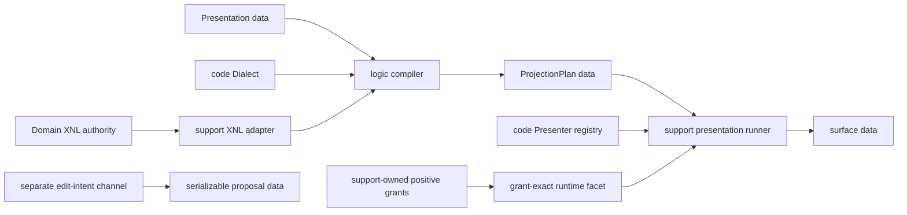
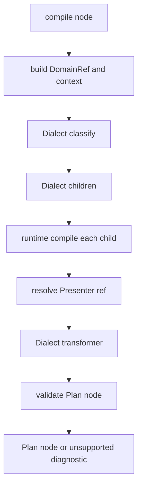

# XNL Projection Layers

## Ownership Map



| Layer | Owner | Public responsibilities | Must not own |
|---|---|---|---|
| [`contract`](../../../../../../packages/dg-cell-mvi-halfcode-contract/src/xnl-projection/index.ts) | `dg-cell-mvi-halfcode-contract` | serializable contracts、processor types、validators、resolution constant | `xnl-core`、compiler、renderer、writer |
| [`logic`](../../../../../../packages/dg-cell-mvi-halfcode-logic/src/xnl-projection/index.ts) | `dg-cell-mvi-halfcode-logic` | recursive compile、Plan id helper、Dialect composition、Presenter resolution、Interaction translation | `xnl-core`、UI、DOM、ValueHost、VFS |
| [`support`](../../../../../../packages/dg-cell-mvi-halfcode-support/src/xnl-projection/index.ts) | `dg-cell-mvi-halfcode-support` | real `XnlNode` adapter/default Dialect、owned Presenter protocol/grants/facet/runner、neutral adapters | UI implementation、Domain mutation、persistence |

唯一允许的 foundation 依赖方向是：

```text
contract <- logic <- support
```

`xnl-core` 只出现在 support 的默认 adapter。三个 package manifest 都只导出
package root，因此消费方不使用 `src/xnl-projection/*` 或
`./xnl-projection` deep import。

## Public Root Imports

```ts
import {
  validateXnlProjectionPlan,
  type XnlProjectionPresentation,
} from 'dg-cell-mvi-halfcode-contract';

import {
  compileXnlProjection,
  composeXnlProjectionDialects,
  createXnlProjectionCompilerRuntime,
  createXnlProjectionPlanNodeId,
  translateXnlProjectionInteraction,
  type CreateXnlProjectionCompilerRuntimeOptions,
  type XnlProjectionCompilerConfig,
  type XnlProjectionCompilerDialect,
  type XnlProjectionCompilerInput,
  type XnlProjectionCompilerRuntime,
  type XnlProjectionTranslateInput,
} from 'dg-cell-mvi-halfcode-logic';

import {
  createDefaultXnlProjectionDialect,
  createXnlProjectionPresenterCapabilityProtocol,
  createXnlProjectionPresenterMethodGrant,
  createXnlProjectionPresenterRegistry,
  createXnlProjectionPresenterRuntimeFacet,
  createXnlProjectionPresenterSnapshotGrant,
  createXnlProjectionRootInput,
  presentXnlProjection,
} from 'dg-cell-mvi-halfcode-support';
```

Logic 的完整 projection public root family 是：

| Family | Public symbols |
|---|---|
| Compiler | `compileXnlProjection`、`createXnlProjectionCompilerRuntime`、`composeXnlProjectionDialects`、`CreateXnlProjectionCompilerRuntimeOptions`、`XnlProjectionCompilerConfig`、`XnlProjectionCompilerDialect`、`XnlProjectionCompilerInput`、`XnlProjectionCompilerRuntime` |
| Identity | `createXnlProjectionPlanNodeId` |
| Interaction | `translateXnlProjectionInteraction`、`XnlProjectionTranslateInput` |

Support 的完整 projection public root family 是：

| Family | Public symbols |
|---|---|
| XNL adapter | `createDefaultXnlProjectionDialect`、`createXnlProjectionRootInput`、`XNL_PROJECTION_DEFAULT_CLASSIFICATION_IDS`、`XNL_PROJECTION_DEFAULT_PRESENTER_IDS`、`CreateDefaultXnlProjectionDialectOptions`、`XnlProjectionNodeFamily`、`XnlProjectionRootInputOptions` |
| Registry/facet | `createXnlProjectionPresenterSnapshotGrant`、`createXnlProjectionPresenterMethodGrant`、`createXnlProjectionPresenterCapabilityProtocol`、`createXnlProjectionPresenterRegistry`、`composeXnlProjectionPresenterRegistries`、`createXnlProjectionPresenterRuntimeFacet`、`CreateXnlProjectionPresenterSnapshotGrantInput`、`CreateXnlProjectionPresenterMethodGrantInput`、`CreateXnlProjectionPresenterCapabilityProtocolInput`、`CreateXnlProjectionPresenterRegistryInput`、`CreateXnlProjectionPresenterRegistryConfig`、`ComposeXnlProjectionPresenterRegistriesInput`、`ComposeXnlProjectionPresenterRegistriesConfig`、`XnlProjectionPresenterCapabilityFactoryRuntime`、`XnlProjectionPresenterCapabilityFactoryConfig`、`XnlProjectionPresenterRegistryRuntime`、`XnlProjectionPresenterRuntime`、`XnlProjectionPresenterRuntimeFacet`、`XnlProjectionPresenterRegistry`、`XnlProjectionPresenterRegistryEntry`、`XnlProjectionPresenterRegistryResult`、`XnlProjectionPresenterResolution`、`XnlProjectionRegisteredPresenterRuntime`、`XnlProjectionRegisteredPresenterAdapter`、`XnlProjectionRegisteredPresenterOutput` |
| Runner | `presentXnlProjection`、`XnlProjectionPresentationRunnerRuntime`、`XnlProjectionPresentationRunnerInput`、`XnlProjectionPresentationRunnerConfig`、`XnlProjectionPresentationResult` |
| Neutral adapters | `createXnlProjectionOutlinePresenterAdapter`、`createXnlProjectionInspectionPresenterAdapter`、`XNL_PROJECTION_OUTLINE_SURFACE_ID`、`XNL_PROJECTION_INSPECTION_SURFACE_ID`、`CreateXnlProjectionNeutralPresenterAdapterInput`、`CreateXnlProjectionNeutralPresenterAdapterConfig` |

## 标准三参数公式

所有动态处理入口都保持：

```text
output = fn(runtime, input, config)
```

对应到当前 API：

```text
plan =
  compileXnlProjection(runtime, compilerInput, invocationConfig)

children =
  dialect.children(runtime, { node, context }, dialectConfig)

classification =
  dialect.classify(runtime, { node, context }, dialectConfig)

planNode =
  dialect.transformers[classification.id](runtime, processorInput, dialectConfig)

commandResult =
  translateXnlProjectionInteraction(runtime, translateInput, invocationConfig)

presenterOutput =
  adapter.present(ownedExactFacade, presenterInput, { surfaceId, options })

surfaceResult =
  presentXnlProjection(runnerRuntime, { plan, surfaceState? }, { surfaceId })
```

当前 compiler 与 Interaction translator 是同步边界：Dialect processor 返回
Promise 会抛错。Presenter runner 是异步边界，会 `await` 每个 adapter。
Granted method wrapper 则分别 containment 同步返回值与 Promise resolved value；它只允许
immutable serializable snapshot 或 same-protocol owned facade 穿过 method return boundary。

## Runtime-Owned Recursion



递归属于 compiler factory 创建的 runtime：

1. `children` processor 只返回 child node、relative path、显式 identity/tag、
   role/source facts。
2. compiler 对每个 child 调用 `runtime.compile(child, invocationConfig)`。
3. child 的 absolute path、ancestors、Presentation 与 inherited `sourceRef` 由
   runtime frame 维护。
4. transformer 得到已经编译的 children，不得到第四个 callback。
5. compiler 合并 classification/Presentation diagnostics 与 provenance，并验证
   transformer output。

`runtime.compile` 是 framework recursion capability，不是业务 transformer 或
host writer。

## 两条 Config Channel

| Channel | Owner | 内容 | 不会进入 |
|---|---|---|---|
| compiler invocation config | 单次 `compileXnlProjection` / `translateXnlProjectionInteraction` 调用 | plain serializable policy；当前 compiler 读取可选 `planId` | Dialect processors |
| composed Dialect config | code-owned Dialect layers | classifier/transformer/translator 的业务配置 | Presentation 或 Plan implementation |

所有 Dialect processor 收到同一个 composed `runtime.dialect.config`；没有配置时
收到稳定的空 record。Invocation config 沿 compiler recursion 传递，但
`planId`、tenant、reason 等调用字段不会泄漏给业务 processor。两条 channel
都拒绝 function、runtime、registry 与 ownership-bearing field。

## Dialect Composition

`composeXnlProjectionDialects([base, ..., instance])` 按调用方已排好的可见层顺序
组合：

- `children` 与 `classify` 由最后一层完整提供；
- transformer map 同 key later-wins；
- `presenterBindings` 按层顺序拼接，解析时最后一个匹配项获胜；
- `translateInteraction` 使用最后一个实际定义它的 layer；
- `config` 与 `metadata` 对 record 做递归 later-wins 合并；
- 输入 Dialect、PresenterRef 与嵌套 options 不被修改或跨 runtime 共享。

这个 helper 不计算 Scope 可见性。后续 Runtime/Document owner 必须先确定 layer
顺序，再调用 composition。

## Presenter Resolution

精确顺序由 `XNL_PROJECTION_RESOLUTION_PRECEDENCE` 固定：

```text
presentation
> semantic
> classification
> source-kind
> unsupported
```

1. **presentation**：所有 exact-match rule 都参与；最后一个带 Presenter 的
   rule 获胜。
2. **semantic**：binding 必须指定并匹配 classification trait，可再约束
   classification/role/sourceKind。
3. **classification**：binding 指定 classification，不带 trait/sourceKind，
   可约束 role。
4. **source-kind**：binding 指定 sourceKind，可再约束 classification/role。
5. **unsupported**：返回 stable `{ id: 'unsupported' }`，不选择任意 raw
   implementation。

每个 binding stage 也是 later matching binding wins。PresenterRef 会在每次
编译中深克隆；修改一份 Plan 不会污染 registry binding 或下一次编译。
`XnlProjectionSemanticPresenterBinding.diagnostics` 是 public contract 字段，但
当前 resolver 只消费 match fields 与 PresenterRef，不会自动把该字段追加到
Plan diagnostics；本 Track 的调用方不能依赖它完成 diagnostic propagation。
