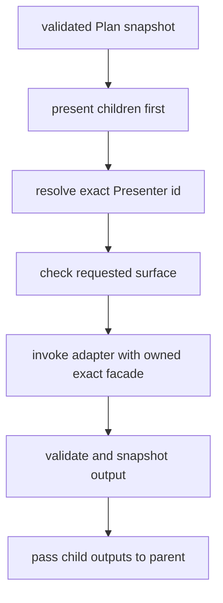

# Presenter And Interaction

## Presenter Registry

Presenter implementation 是代码对象，通过 stable id 注册：

```text
Plan PresenterRef.id
  -> support-owned registry
  -> exact code-owned PresenterAdapter
  -> requested surface
```

`createXnlProjectionPresenterRegistry(runtime, input, config)` 只接受显式
`{ duplicate: 'reject' }`。同一 registry 中重复 id 直接失败。

`composeXnlProjectionPresenterRegistries(...)` 要求调用方显式选择：

- `conflict: 'reject'`：任何跨层重复 id 都失败；
- `conflict: 'last-wins'`：后一个 registry 覆盖前一个，但不修改任何输入
  registry。

Registry、adapter config 与 metadata 会被快照；未知 id 返回
`UNKNOWN_XNL_PROJECTION_PRESENTER`，不会尝试 JSON、text 或任意 fallback
adapter。

## Recursive Runner

`presentXnlProjection` 使用 post-order：



Runner 的公共调用是：

```ts
const result = await presentXnlProjection(
  {
    presenterRegistry,
    presenterRuntime: runtimeFacet,
  },
  {
    plan,
    surfaceState,
  },
  {
    surfaceId,
  },
);
```

执行前会验证并快照整份 Plan 和可选 `surfaceState`。每个 adapter 得到的精确
三参数调用为：

```ts
output = adapter.present(
  ownedExactFacade,
  {
    node,
    childOutputs,
    surfaceState,
  },
  {
    surfaceId,
    options,
  },
);
```

- `childOutputs` 已完成，顺序与 Plan children 一致。
- Adapter registration `config` 是默认 options。
- `node.presenter.options` 做顶层浅合并并 later-wins；嵌套 record 不做深合并。
- runner config 的其他字段不会混入 options。
- adapter 的 `surfaceId`、requested `surfaceId` 与 output `surfaceId` 必须完全
  相同。
- output value、metadata、diagnostics 必须满足纯数据/完整 diagnostic contract。

任一 child、registry resolution、surface、adapter throw 或 output validation
失败都会返回 `{ ok: false, diagnostics }`；runner 不调用 fallback。

公开 facet 有只读 `view` 字段，但 runner 不信任调用方可见字段；它从 support 私有
owner record 解析同一 owned facade 后才调用 adapter。正常 `present` 的返回值是
validated `XnlProjectionPresenterOutput` surface data，不是 Interaction、Command 或
authoring submission。

## Assembly-Created Runtime Facet

Presenter 不直接接收 host runtime。装配侧先用 support-owned positive grants 声明
code-owned protocol，再构造 exact facade：

```ts
import {
  createXnlProjectionPresenterCapabilityProtocol,
  createXnlProjectionPresenterRuntimeFacet,
  createXnlProjectionPresenterSnapshotGrant,
} from 'dg-cell-mvi-halfcode-support';

type PresenterView = { readonly locale: string };
const localeGrant = createXnlProjectionPresenterSnapshotGrant<
  typeof presenterSource,
  PresenterView,
  'locale',
  'locale'
>(
  {},
  {
    id: 'demo.presenter.grant.locale',
    sourceKey: 'locale',
    facadeKey: 'locale',
  },
  {},
);
const presenterProtocol = createXnlProjectionPresenterCapabilityProtocol<
  typeof presenterSource,
  PresenterView
>(
  {},
  { id: 'demo.presenter.protocol.locale', grants: [localeGrant] },
  {},
);
const runtimeFacet = createXnlProjectionPresenterRuntimeFacet(
  { source: presenterSource, protocol: presenterProtocol },
  {},
  {},
);
```

Runner 只接受由该 factory 创建并登记的 facet；把普通 host object 伪装成
`presenterRuntime` 会在调用 adapter 前失败。Object 和 class instance 都可以作为
source，adapter 收到的是只含 protocol grants 的新 frozen facade，不是 source identity。
合法 source 可以继续拥有任意额外 ungranted fields、methods、symbols 或 accessors；
projection 不枚举或读取它们，它们不使 facade construction 失败，也不会进入 facade。

这个边界的语义必须诚实：

- 它证明 assembly 通过 owned protocol 显式选择了传给 Presenter 的 positive grants。
- TypeScript 把 view 暴露为 exact readonly projected interface；runner 不再靠
  source 字段名或 source enumeration 猜权限。
- Facet brand/provenance 只用于识别 support-owned facet 与 owner record；brand 本身
  不是 attenuation。实际 attenuation 来自复制 snapshot、包装 granted method 并
  构造 grant-exact facade。
- 它不证明 JavaScript object 内部没有副作用，也不会深冻结 class、审计隐藏
  closure 或证明 arbitrary closure purity。
- 因此 assembly owner 必须只授予 Presenter 真正需要的 capability；source 上其余
  Domain XNL、ValueHost、VFS 或 mutation authority 不会进入 facade。

这里的 direct-possession guarantee 是：Presenter 不会直接取得 raw source identity、
source prototype 或 ungranted host object graph。它不是“显式授予的方法无法通过绑定
owner 或 closure 产生 effect”的保证。

### Trusted Method Policy And Return Containment

Method grant 是 trusted code-owned protocol 的权限与 effect policy 决策。Support 只从
grant 指定的 own/prototype data-function descriptor 捕获方法，绑定原 source owner，再将
wrapper 放入 facade；grant target 是 accessor 时失败且不执行 getter。

Wrapper 对同步返回值和 Promise resolved value 使用相同 containment：

- primitive/serializable data 被复制为 immutable serializable snapshot；
- 已登记且由同一 protocol 拥有的 facade 可以按 owned identity 返回；
- raw source、host/class instance、foreign-protocol facade、function、symbol、循环或其他
  不可序列化 object graph fail closed，不交给 Presenter。

Return guard 发生在 granted method 已经执行之后。它不回滚 method internal effect，
也不证明 closure purity。若 trusted protocol 显式授予一个改名或 effectful method，
runtime 把它视为已授权 capability；错误授权是 protocol policy/review 缺陷，不是 runtime
可通过字段名或 reflection 自动撤销的权限。

### Breaking Raw-View Migration

旧的 `createXnlProjectionPresenterRuntimeFacet(rawView)` 成功语义已经移除，不是 deprecated
compatibility path。当前调用方必须依次创建 support-owned grants、owned protocol，再调用
三参数 factory：

```text
raw source
  -> create snapshot/method grants
  -> create owned capability protocol
  -> createXnlProjectionPresenterRuntimeFacet(
       { source, protocol },
       {},
       {},
     )
```

Raw host 直接当 view、复制/伪造 protocol 或 facet、identity projection、unknown grant、
facet extra own key 与 owner-record mismatch 都在 Presenter 调用前 fail closed。不存在
one-argument overload、compatibility wrapper 或 raw escape hatch。

## 两个中立 Presenter

Support 提供两个无 UI adapter factory：

| Adapter | Surface | Output |
|---|---|---|
| `createXnlProjectionOutlinePresenterAdapter` | `xnl-projection.surface.outline` | label、Plan node id 与递归 children 的 outline record |
| `createXnlProjectionInspectionPresenterAdapter` | `xnl-projection.surface.inspection` | DomainRef、classification、PresenterRef、child count 与递归 children 的 inspection record |

它们都只返回可序列化数据，不依赖 Vue、DOM、Tiptap 或 XNL writer。同一 Plan
可以把相同 stable Presenter id 分别绑定到两个独立 registry，从而得到两种
surface；见 [examples](examples.md)。

## Surface Output And Edit Intent

正常 render channel 只返回 validated surface data：

```text
Presenter adapter present -> XnlProjectionPresenterOutput<surface data>
```

只有独立 edit-intent channel 使用 `XnlProjectionPresenterEditIntent`，并且只产生
serializable `XnlProjectionInteraction` 或 `XnlProjectionDomainCommand` proposal data：

```text
Presenter edit intent -> serializable proposal data
external owner -> translator and/or XnlAuthoringProposalPort -> accept/persist
```

Edit-intent proposal/facet 不包含 translator、authoring session、`submit` callback 或其他
submit authority。外部 owner 是否翻译或提交 proposal，发生在 Presenter 之外。当前只交付
data contract；Tiptap NodeView、Document consumer 与 submit bridge wiring 都是
**TIPTAP FUTURE / NOT IMPLEMENTED BY THIS TRACK**。

## Interaction Translation

Interaction 是 surface 发出的意图数据，不是 mutation：

```ts
const outcome = translateXnlProjectionInteraction(
  compilerRuntime,
  {
    planNode,
    interaction,
    sourceNode,
  },
  invocationConfig,
);
```

执行顺序：

1. runtime validator 验证 Interaction 的 closed shape 与 serializable data。
2. `interaction.target.planNodeId` 必须与传入的 `planNode.id` 完全相等。
3. 无 Dialect translator 时返回 `unsupported`。
4. translator 以
   `fn(runtime, { planNode, interaction, sourceNode? }, dialectConfig)` 调用。
5. translator output 通过 closed CommandResult validator；非法 output 转成
   `unsupported` diagnostic。

结果只可能是：

| Status | Meaning |
|---|---|
| `translated` | 得到一个纯数据 Domain Command proposal，可附 diagnostics |
| `rejected` | 输入或业务规则拒绝，没有 command |
| `unsupported` | 当前 Dialect 不支持或 translator output 非法，没有 command |

该函数不 materialize Candidate XNL、不计算 diff、不 apply mutation、不调用
ValueHost/VFS writer，也不产生 accepted revision。Generic
[authoring session](../authoring/README.md) is the separate runtime owner that
decides whether a proposal is accepted. Its proposal port is not embedded in the
Presenter facade or edit-intent data.
